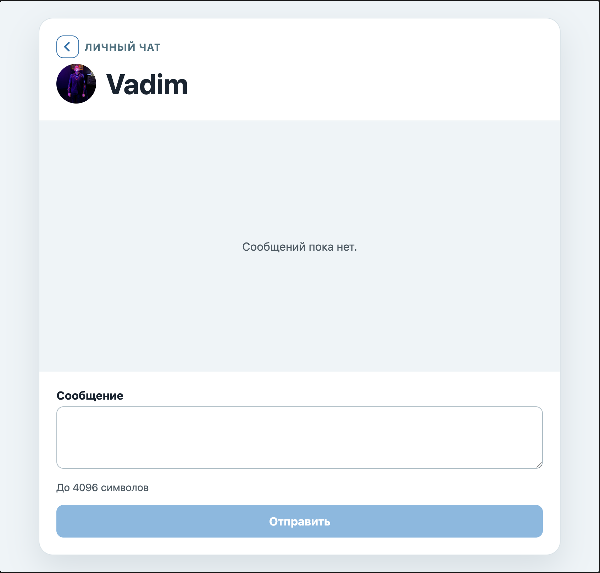
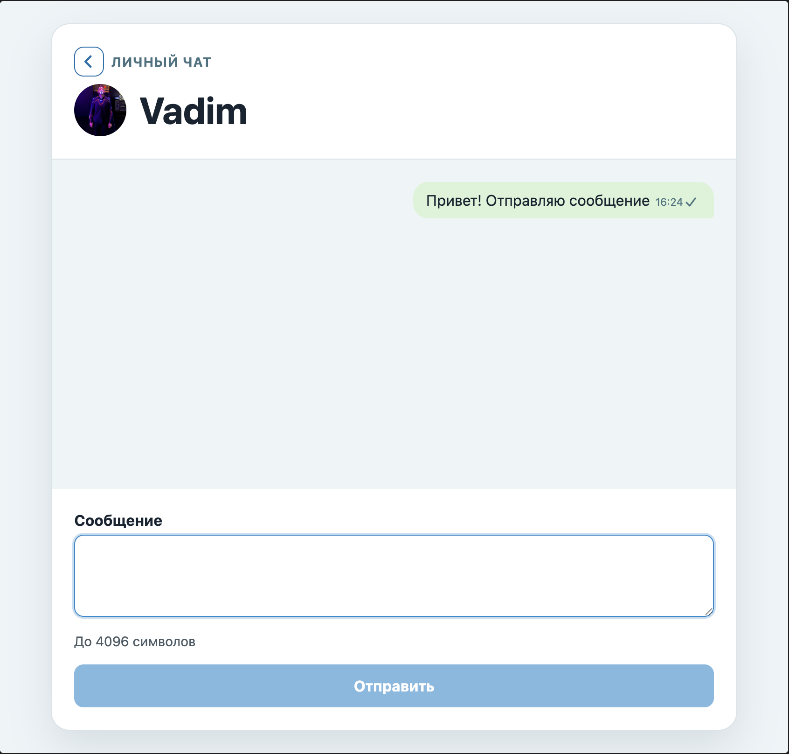
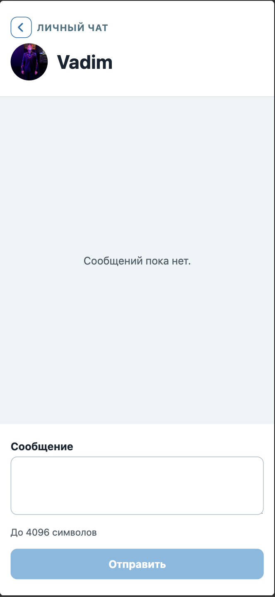

# Telegram text chat

Тестовое задание: browser-only React-клиент для одного активного личного текстового чата в Telegram через [GREEN-API](https://green-api.com/telegram). Приложение позволяет подключить инстанс, открыть чат по номеру телефона, отправлять и получать текстовые сообщения в интерфейсе, стилизованном под Telegram. Список чатов, групповые чаты и медиа не поддерживаются.

## Возможности

- Подключение по `idInstance` и `apiTokenInstance`.
- Создание личного чата по номеру телефона в международном формате.
- Отправка текстовых сообщений и повторная отправка при ошибке.
- Получение входящих сообщений через HTTP API GREEN-API.
- Отображение статусов исходящего сообщения: отправляется, в очереди, доставлено, прочитано или ошибка.
- Адаптивный интерфейс для мобильных и десктопных экранов.

## Технологии

- React 19, TypeScript и Vite;
- GREEN-API HTTP API: `SendMessage`, `ReceiveNotification`, `DeleteNotification`, `GetContactInfo`;
- Vitest и React Testing Library;
- ESLint.

## Онлайн-демо

[Открыть приложение](https://vgratsilev.github.io/green-api-test/).

Для проверки потребуется отдельный авторизованный инстанс GREEN-API и номер собеседника. API origin, данные доступа и номер получателя вводятся в форме и остаются только в памяти вкладки; перезагрузка страницы завершает сессию.

## Скриншоты и видео

### Desktop

| Подключение | Чат без сообщений |
| --- | --- |
|  |  |
| Отправка сообщения | Ответ собеседника |
|  |  |

### Mobile

| Подключение | Чат без сообщений |
| --- | --- |
|  |  |
| Отправка сообщения | Ответ собеседника |
|  |  |

[Короткая видео-презентация сценария](public/demo/walkthrough.webm) показывает отправку и получение сообщений.

## Диаграммы

[Диаграммы архитектуры, типов, состояний и последовательностей](docs/diagrams/README.md) показывают поток подключения, отправки и получения сообщений.

## Локальный запуск

Требуется Node.js 20.19+ или 22.12+ (диапазоны, поддерживаемые Vite 7).

```sh
npm ci
```

В форме подключения укажите публичный HTTPS API origin, показанный в консоли вашего инстанса GREEN-API. Используйте точный origin инстанса, включая его поддомен, без пути, query и credentials. Не задавайте API host через environment variable. Затем запустите приложение:

```sh
npm run dev
```

Откройте адрес, который покажет Vite (обычно `http://localhost:5173`), и введите API origin, ID инстанса, API token и номер получателя.

Используйте отдельный авторизованный инстанс: `webhookUrl` должен быть пустым, а входящие уведомления и статусы исходящих сообщений — включены. У HTTP-очереди не должно быть других consumers.

## Безопасность и CORS

API origin, ID инстанса и token нужны для запросов GREEN-API, поэтому они существуют только в состоянии приложения во вкладке. Приложение не сохраняет их в `localStorage`, URL или исходном коде. Не добавляйте credentials в `.env`-файлы или публичную конфигурацию сборки.

Клиент работает в браузере, поэтому GREEN-API должен разрешать CORS для origin приложения. Перед использованием проверьте на выделенном инстансе запросы `GET ReceiveNotification`, `POST SendMessage` и `DELETE DeleteNotification`.

## GitHub Pages

Workflow [deploy-pages.yml](.github/workflows/deploy-pages.yml) собирает и публикует приложение при push в `main`; его также можно запустить вручную через **Actions → Deploy GitHub Pages → Run workflow**. Перед первым запуском в **Settings → Pages** выберите **GitHub Actions** как источник публикации.

Во время публикации workflow задаёт Vite base path репозитория и не задаёт API origin: пользователь вводит его в форме после открытия сайта. Локальная разработка остаётся на `/`.

## Проверки

```sh
npm run lint
npm run test
npm run build
```
