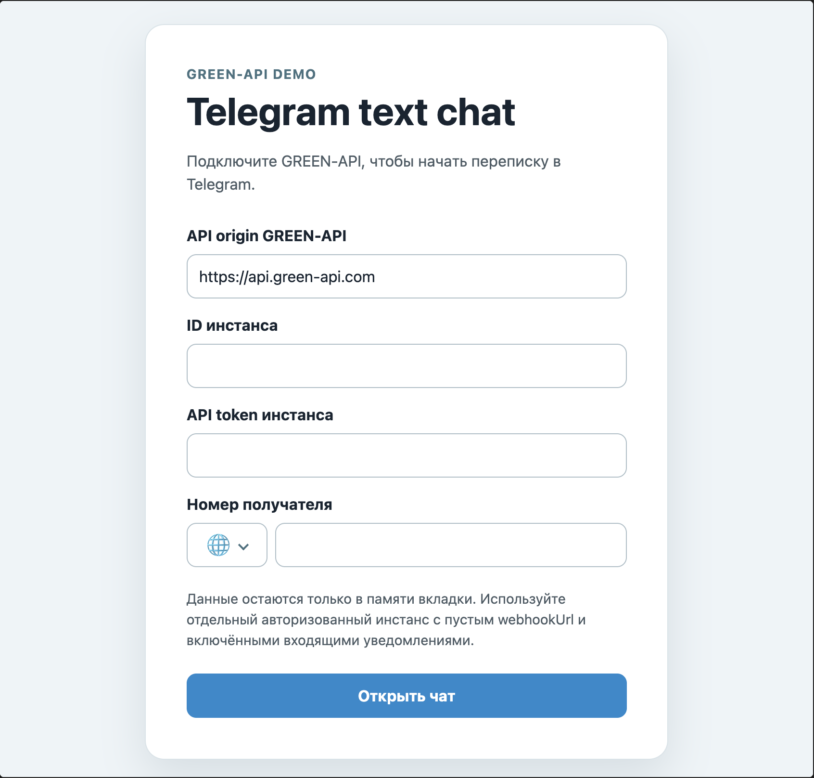
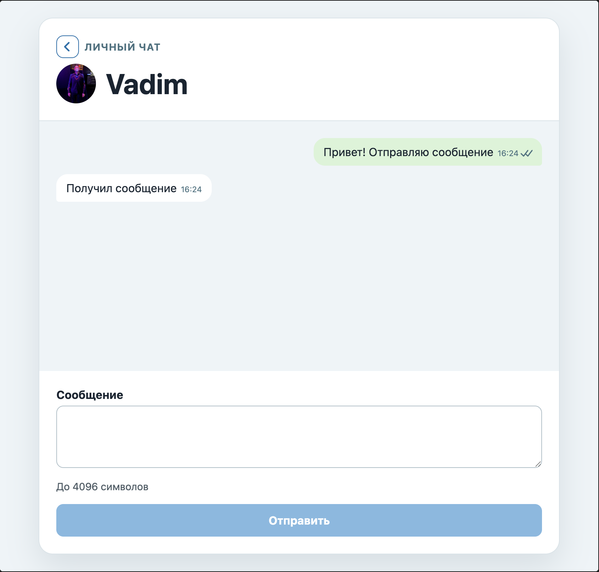
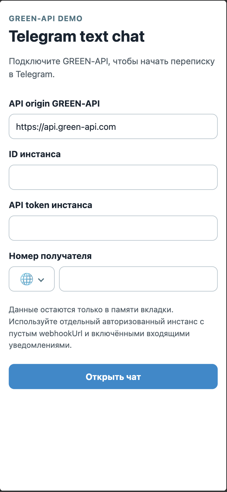
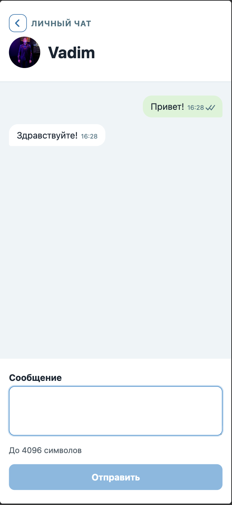

# Telegram text chat

Тестовое задание: клиент на React для одного активного личного текстового чата в Telegram через [GREEN-API](https://green-api.com/telegram). Отдельного бэкенда нет: приложение отправляет запросы к GREEN-API прямо из браузера. Можно подключить инстанс, открыть чат по номеру телефона и отправлять и получать сообщения. Список чатов, группы и медиа не поддерживаются.

## Возможности

- Подключение с проверкой авторизации инстанса по `idInstance` и `apiTokenInstance`.
- Открытие личного чата по номеру в международном формате; отображение имени и аватара контакта.
- Отправка и повторная отправка текстовых сообщений.
- Получение входящих сообщений и статусов отправки: ожидает отправки, отправляется, в очереди, доставлено, прочитано или ошибка.
- Адаптивный интерфейс для мобильных и десктопных экранов.

## Технологии

- React 19, TypeScript и Vite;
- GREEN-API HTTP API: `GetStateInstance`, `GetContactInfo`, `SendMessage`, `ReceiveNotification`, `DeleteNotification`;
- Vitest, React Testing Library, ESLint и Prettier.

## Онлайн-демо

[Открыть приложение](https://vgratsilev.github.io/green-api-test/).

Для проверки нужны авторизованный инстанс GREEN-API и номер собеседника. API origin, данные доступа и номер вводятся в форме и хранятся только в памяти вкладки. После перезагрузки страницы подключение нужно выполнить заново.

## Скриншоты и видео

### Desktop

<p>
  
  
</p>

### Mobile

<p>
  
  
</p>

Короткий сценарий работы показан в [видео](public/demo/walkthrough.webm).

## Диаграммы

[Диаграммы архитектуры, типов, состояний и последовательностей](docs/diagrams/README.md) показывают подключение, отправку и получение сообщений.

## Локальный запуск

Требуется Node.js 20.19+ или 22.12+ (версии, поддерживаемые Vite 7).

```sh
npm ci
npm run dev
```

Откройте адрес, который покажет Vite (обычно `http://localhost:5173`). В форме укажите публичный HTTPS API origin инстанса — точный адрес из консоли GREEN-API, без пути, параметров запроса и данных доступа — а также ID инстанса, API token и номер собеседника.

Используйте отдельный авторизованный инстанс с пустым `webhookUrl` и включёнными уведомлениями о входящих сообщениях и статусах отправки. Не запускайте другие клиенты, которые читают ту же HTTP-очередь уведомлений.

## Безопасность и CORS

Приложение не сохраняет API origin, ID инстанса и token в `localStorage`, URL или исходном коде. Не помещайте данные доступа в `.env` или публичную конфигурацию сборки.

GREEN-API должен разрешать CORS для origin приложения — `localhost` при локальном запуске или домена GitHub Pages для онлайн-демо.

## Публикация

Workflow [`deploy-pages.yml`](.github/workflows/deploy-pages.yml) запускается при push в `main` и вручную через **Actions → Deploy GitHub Pages → Run workflow**. Для первой публикации выберите **GitHub Actions** в **Settings → Pages**. Workflow задаёт Vite base path репозитория; API origin пользователь вводит в приложении.

## Проверки

```sh
npm run lint
npm run format:check
npm run test
npm run build
```
