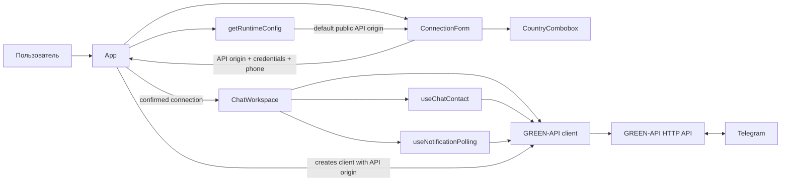
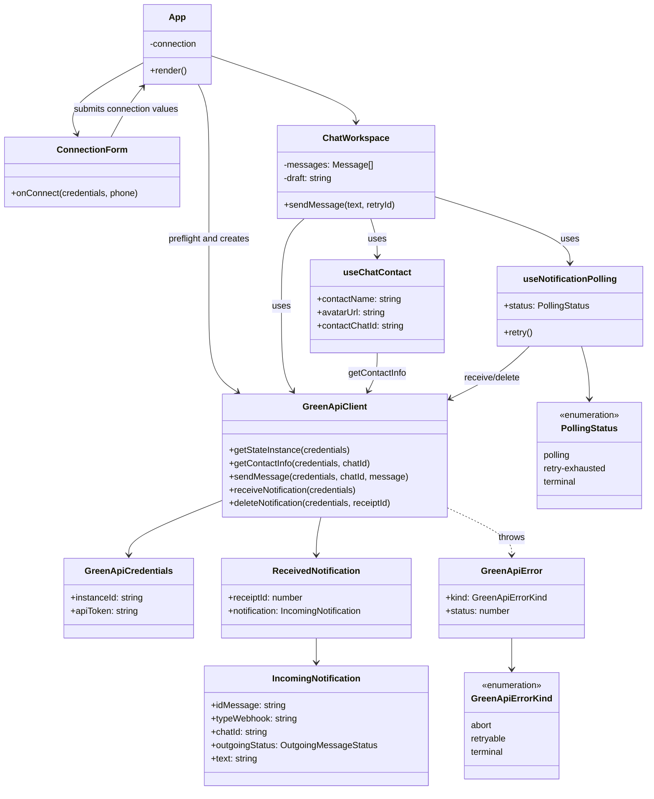
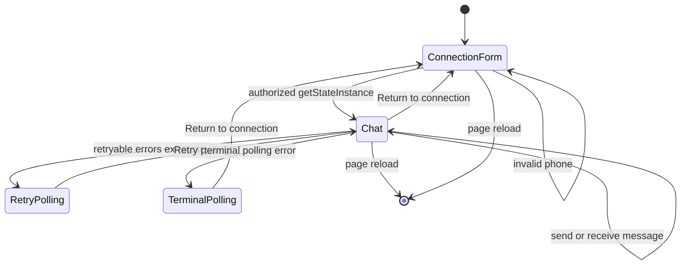
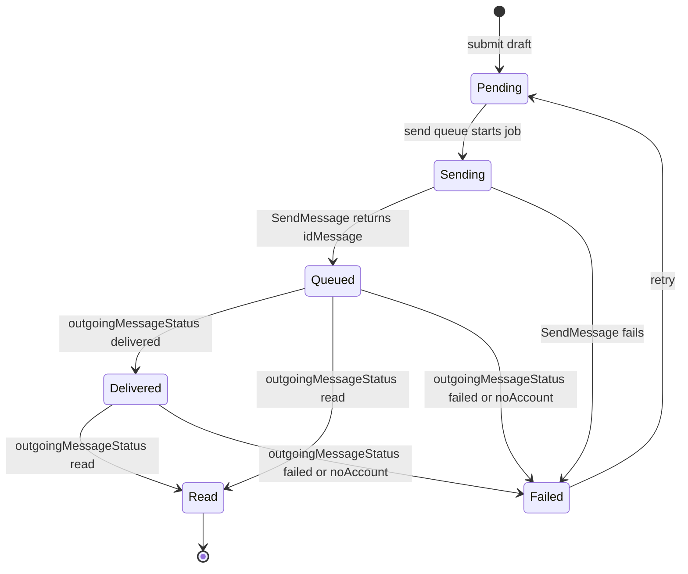
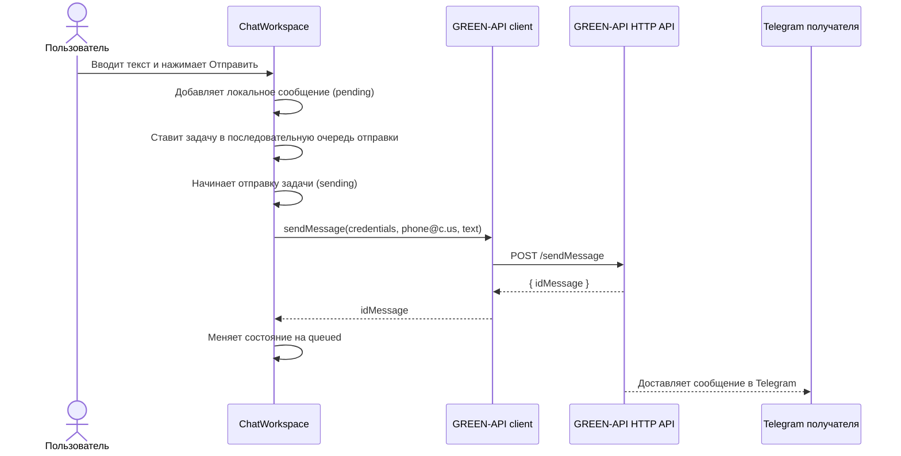
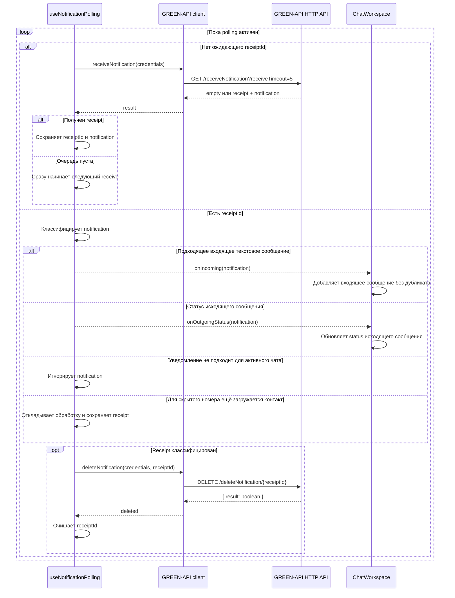

# Диаграммы проекта

Диаграммы описывают реализованный клиент, а не целевую архитектуру. Они хранятся в Mermaid, поэтому GitHub рендерит их прямо в этом документе, а изменения можно просматривать в обычном diff.

## 1. Компоненты и внешние границы

`ConnectionForm` принимает точный публичный HTTPS API origin из консоли инстанса. `App` сохраняет origin, credentials и номер только в состоянии вкладки после успешного preflight через `getStateInstance`; значения не записываются в URL, localStorage, environment variables или репозиторий. Приложение поддерживает один активный личный текстовый чат.

## 2. Диаграмма классов и типов

## 3. Состояния пользовательской сессии

Reloading the page intentionally ends the session: its credentials exist only in React state.

## 4. Переходы состояния исходящего сообщения

Если webhook-статус приходит раньше ответа `SendMessage`, `ChatWorkspace` временно кэширует его по `idMessage`, затем применяет после создания сообщения.

## 5. Последовательность отправки текста

При ошибке запроса сообщение остаётся в чате со статусом `failed`, а черновик остаётся в поле ввода. Повторная отправка возвращает сообщение в очередь со статусом `pending`; задачи отправляются последовательно.

## 6. Получение уведомлений и подтверждение очереди

Один polling run выполняет только одну операцию с очередью одновременно. При остановке hook отменяет запрос; новый run ожидает завершения старой операции, чтобы не читать и не удалять уведомления параллельно. Если для входящего сообщения со скрытым номером ещё не загружена контактная идентичность, hook сохраняет receipt и откладывает классификацию. Разрешённый ответ DELETE завершает receipt даже при `result: false`; повторяемая ошибка сохраняет его для повтора. Повторяемые ошибки получают задержки 1, 2 и 4 секунды; затем UI предлагает ручной перезапуск.

## Проверка актуальности

При изменении `src/api/greenApi.ts`, `src/features/chat/useNotificationPolling.ts`, `src/features/chat/ChatWorkspace.tsx` или границ компонентов обновите соответствующую диаграмму в этом документе. Поведение polling дополнительно зафиксировано в [решении о порядке receipt](../solutions/logic-errors/polling-run-receipt-ordering.md).
