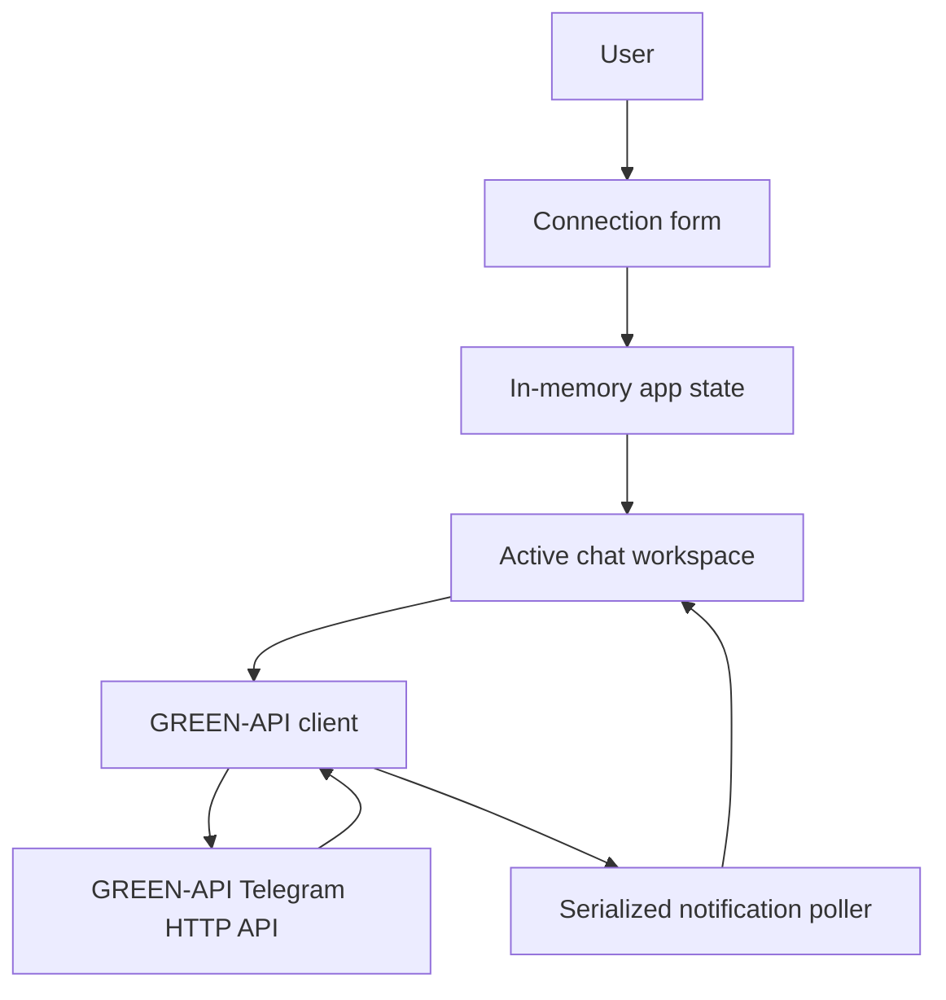
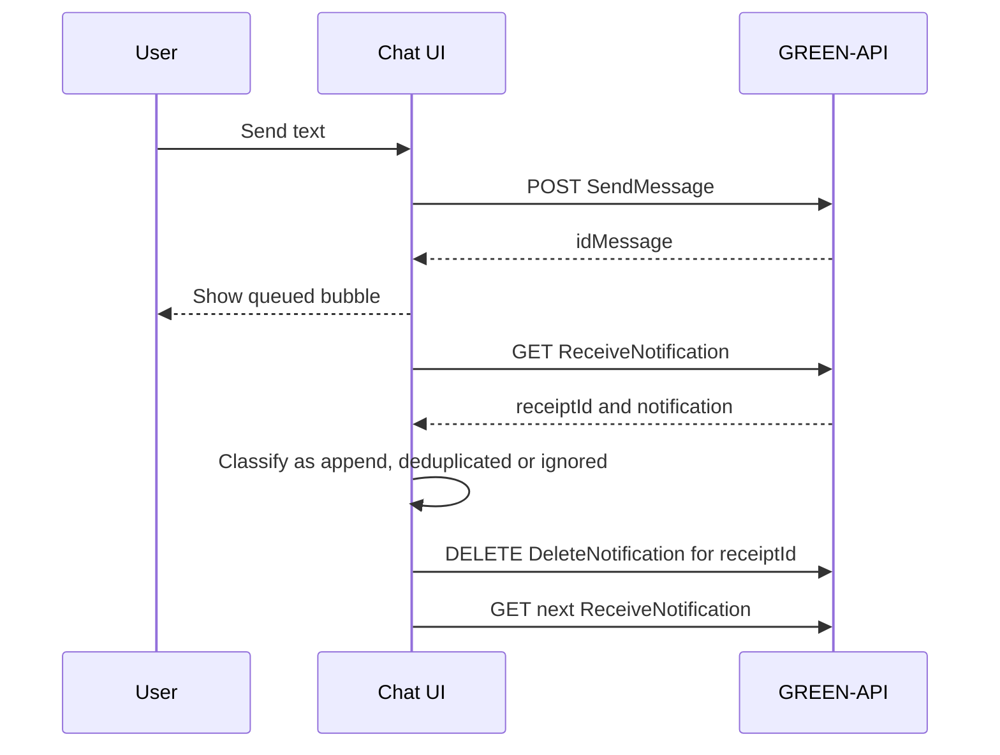
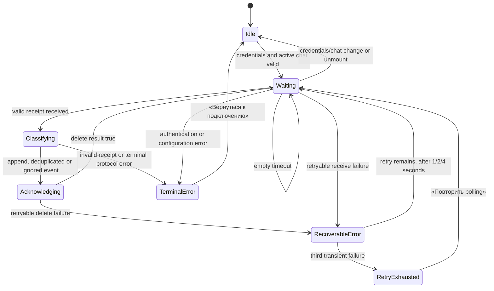
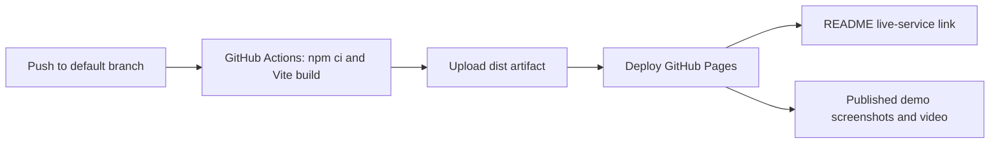

# Telegram Text Chat Interface - Plan

## Goal Capsule

- **Objective:** Пользователь может локально или по опубликованной ссылке открыть один личный чат Telegram через свой инстанс GREEN-API, отправить текст и увидеть текстовый ответ собеседника.
- **Means:** Одностраничное React-приложение с прямым HTTP-вызовом GREEN-API, локальной лентой сообщений и последовательным чтением очереди уведомлений. (KTD2, KTD4)
- **Authority:** `task.md` определяет пользовательский сценарий, текстовый-only scope и GREEN-API методы. Официальная Telegram-документация GREEN-API определяет формат запросов и уведомлений.
- **Execution profile:** В этом репозитории нет исходного приложения, поэтому работа начинается с bootstrap React-проекта и тестовой инфраструктуры.
- **Stop conditions:** Не продолжать browser-only интеграцию, если проверка CORS на реальном авторизованном инстансе не разрешает `GET`, JSON `POST` и `DELETE` с origin приложения. Не добавлять proxy без нового решения о scope.
- **Publication conditions:** Не заявлять ссылку на сервис, пока GitHub Pages workflow не опубликует production build; не помещать в Pages, README, screenshots или video API token, `idInstance`, полный request URL или raw response.

---

## Product Contract

### Summary

План создаёт минимальный светлый чат, похожий на Telegram. После ввода `idInstance` и `apiTokenInstance` пользователь открывает один чат по номеру телефона, отправляет текст и получает текстовые ответы из HTTP-очереди GREEN-API.

### Problem Frame

GREEN-API даёт доступ к Telegram через HTTP API, но пользователю нужен простой интерфейс вместо ручных вызовов методов. Для корректного ответа недостаточно отрисовать форму отправки: клиент должен безопасно обработать FIFO-очередь уведомлений и подтвердить каждое обработанное уведомление.

### Requirements

**Connection and scope**

- R1. Приложение работает как React-клиент и показывает форму только с `idInstance` и `apiTokenInstance`; эти значения существуют только в памяти вкладки и исчезают после reload.
- R2. Необходимый GREEN-API `apiUrl` поступает из публичной конфигурации развёртывания, а не из формы и не из хранилища секретов браузера.
- R3. Перед сетевыми действиями приложение объясняет, что инстанс должен быть авторизован, настроен на HTTP API с пустым `webhookUrl` и включёнными входящими уведомлениями; для demo он не должен иметь других consumers очереди.

**Direct text chat**

- R4. Пользователь вводит международный номер получателя, а приложение открывает один локальный личный чат без отдельного метода создания чата в GREEN-API.
- R5. Пользователь отправляет только непустые текстовые сообщения длиной до 4096 символов через `SendMessage`; успешный `idMessage` отображается как постановка в очередь, а не как доставка.
- R6. Приложение показывает только входящие текстовые сообщения активного чата, полученные через HTTP API GREEN-API, как literal text без HTML, Markdown или linkification.
- R7. Клиент обрабатывает очередь последовательно: получает уведомление с валидным receipt, классифицирует его как append, deduplicated или ignored, подтверждает `DeleteNotification` и только затем читает следующее.

**Interface boundaries**

- R8. Интерфейс использует простую светлую композицию Telegram: заголовок чата, лента bubbles и composer, без лишних экранов и функций.
- R9. В scope не входят медиа, голосовые сообщения, группы, история чатов, delivery/read-статусы, проверка аккаунта получателя, поддержка нескольких вкладок, Markdown/linkification и автоматический повтор неоднозначной отправки.

**Local run, publication and presentation**

- R10. README позволяет запустить проект из чистого clone: установить зависимости, задать только публичный `VITE_GREEN_API_URL` в игнорируемом `.env.local`, запустить development server и ввести `idInstance` и token только в форму браузера.
- R11. Статический Vite build развёртывается на GitHub Pages через GitHub Actions; README содержит фактическую публичную ссылку после успешного deploy, а production asset paths работают по repository Pages base path.
- R12. README содержит актуальные screenshots и ссылку на короткую video-презентацию базового сценария; все материалы используют обезличенные данные, masked credentials и не показывают Developer Tools, Network panel или API URLs.
- R13. Connection form и active chat остаются полностью usable на мобильном viewport шириной 320px и на широком desktop viewport шириной 1440px: без горизонтального scroll страницы, с доступными с клавиатуры controls, видимым focus и связанными с полями validation/error messages.
- R14. При terminal polling error приложение показывает безопасное объяснение и действие «Вернуться к подключению»; при исчерпании transient retries — действие «Повторить polling», не создающее дубликатов или параллельных consumers.

### Success Criteria

- Пользователь с подготовленным инстансом вводит доступ, указывает номер и видит пустой чат без перезагрузки страницы.
- После успешного `SendMessage` в ленте появляется исходящий текст со статусом постановки в очередь.
- После ответа в Telegram соответствующий входящий текст появляется в активном чате один раз.
- Reload возвращает приложение к форме доступа и не восстанавливает токен или ленту.
- Новый разработчик выполняет local-start инструкцию без обращения к исходному коду и без внесения credentials в tracked files.
- После успешного Pages deployment README ведёт на работающий production URL, а его asset paths не дают 404 из-за repository subpath.
- Pages URL подтверждён не только загрузкой assets, но и успешным browser CORS smoke check всех трёх GREEN-API методов именно с final Pages origin.
- На ширине 320px и 1440px connection form и active chat не создают горизонтальный scroll страницы; поля, composer и действия остаются доступны с клавиатуры, а ошибки связаны с соответствующими полями.

### Actors

- A1. Пользователь приложения — владелец авторизованного инстанса GREEN-API.
- A2. Собеседник — отвечает в Telegram.
- A3. GREEN-API Telegram HTTP API — ставит отправки в очередь и выдаёт уведомления.
- A4. GitHub Pages и GitHub Actions — собирают статический сайт и публикуют его по публичному URL.

### Key Flows

- F1. Подключение и открытие чата
  - **Trigger:** A1 открывает сайт.
  - **Actors:** A1, A3.
  - **Steps:** A1 вводит доступ, затем международный номер и открывает локальный чат.
  - **Outcome:** Активный чат готов к отправке и чтению уведомлений. Covers R1, R2, R4.
- F2. Отправка текста
  - **Trigger:** A1 отправляет заполненный composer.
  - **Actors:** A1, A3, A2.
  - **Steps:** Клиент валидирует текст и вызывает `SendMessage`.
  - **Outcome:** После `idMessage` исходящий bubble получает статус «в очереди». Covers R5.
- F3. Получение ответа
  - **Trigger:** В очереди A3 появляется уведомление.
  - **Actors:** A1, A2, A3.
  - **Steps:** Клиент читает одну запись, показывает подходящий текст или игнорирует запись, подтверждает receipt и продолжает цикл.
  - **Outcome:** Ответ A2 появляется один раз, а чужая или non-text запись не блокирует очередь. Covers R6, R7.
- F4. Локальный запуск и публикация
  - **Trigger:** Разработчик следует README или пушит готовый build в default branch.
  - **Actors:** A1, A4.
  - **Steps:** README задаёт public API host локально; workflow собирает `dist` с корректным Pages base path и публикует artifact.
  - **Outcome:** Пользователь получает local-start путь и ссылку на сервис; presentation assets показывают тот же минимальный сценарий. Covers R10, R11, R12.

### Key Decisions

- **One active text chat:** Первый выпуск ведёт только один активный личный диалог, чтобы не обещать историю или маршрутизацию общей очереди. Governs R4, R6, R9.
- **No local persistence:** Reload намеренно очищает доступ и временную ленту, потому что API-токен передаётся в URL запроса. Governs R1, R9.

### Acceptance Examples

- AE1. Covers R1, R2. При корректной публичной конфигурации пользователь вводит ID и токен, затем видит форму номера; токен не показан в URL или ошибке.
- AE2. Covers R4. Номер `+7 (999) 123-45-67` открывает личный чат с нормализованным идентификатором для отправки по номеру.
- AE3. Covers R5. Текст из 4096 символов отправляется; пустой текст и 4097-й символ блокируются до HTTP-запроса.
- AE4. Covers R6, R7. Ответ собеседника типа `incomingMessageReceived` и `textMessage` от номера активного чата показывается в текущей ленте как literal text, после чего receipt подтверждается.
- AE5. Covers R7. Уведомление другого чата или не-текстовое уведомление не рисуется, но подтверждается, чтобы следующая запись FIFO стала доступна.
- AE6. Covers R1, R9. После reload приложение снова просит доступ и не показывает прежние сообщения.
- AE7. Covers R10. Новый contributor выполняет README steps: `npm ci`, копирует `.env.example` в `.env.local`, задаёт только public API host и после `npm run dev` видит форму ID/token; `.env.local` и credentials не попадают в Git.
- AE8. Covers R11. Push в default branch запускает Pages workflow, который публикует `dist`; README ведёт на полученный Pages URL, а browser загружает scripts и styles с repository subpath.
- AE9. Covers R12. README показывает connection и active-chat screenshots и ведёт к короткому video walkthrough; token, instance ID, full request URL и raw network data не видны.
- AE10. Covers R13. На viewport 320px и 1440px connection form и active chat помещаются без horizontal page scroll; labels, focus и validation/error messages позволяют пройти keyboard flow без потери контекста.
- AE11. Covers R14. После terminal auth/configuration/protocol error polling прекращается, пользователь видит safe explanation и возвращается к connection form; после трёх transient failures действие «Повторить polling» возобновляет один consumer и для delete продолжает работу с тем же receipt.

### Scope Boundaries

- **Deferred to Follow-Up Work:** Backend/proxy, если реальная CORS-проверка докажет, что browser-only вызовы невозможны; история, список чатов, межвкладочная координация, статус доставки, медиа, группы, custom domain и production monitoring.
- **Outside this product's identity:** Администрирование инстанса, авторизация Telegram, изменение `webhookUrl` через `SetSettings`, хранение секретов, рассылки, chatbot-автоматизация и публикация credentials в CI/CD.

---

## Planning Contract

### Key Technical Decisions

- KTD1. **Bootstrap with Vite, React, TypeScript, Vitest and React Testing Library.** В пустом репозитории нет версии React или соглашений, поэтому bootstrap должен зафиксировать базовые версии и scripts, а UI останется на `useState`, `useEffect` и controlled inputs.
- KTD2. **Keep the app browser-only and configure the API host publicly.** `VITE_GREEN_API_URL` содержит HTTPS `apiUrl` из консоли инстанса; ID и токен остаются только в React state, а token input маскируется. Клиент не использует storage, URL parameters, analytics, console logging, raw response bodies или текст ошибок для передачи секрета. Browser calls должны быть читаемы JavaScript через CORS, без `no-cors`; отсутствие разрешённого preflight или response — scope blocker. Это учебный/local сценарий, а не production-safe хранение ключа. (R1, R2, R3)
- KTD3. **Put GREEN-API protocol details behind one client module.** Он строит URL из `apiUrl`, instance ID, method и token, вызывает lower-camel-case endpoints `sendMessage`, `receiveNotification` и `deleteNotification`, а receive использует фиксированный timeout 5 seconds без новой пользовательской настройки. Модуль возвращает только нормализованные данные и safe error taxonomy: abort, terminal auth/configuration/protocol или retryable transport/rate-limit/server failure. (R5, R6, R7)
- KTD4. **Create a local direct chat from a normalized phone number.** UI хранит canonical digits-only номер, формирует `<digits>@c.us` только для отправки и принимает incoming text, когда `senderPhoneNumber` после нормализации совпадает с canonical номером, а `chatType` равен `user`. Raw Telegram `chatId` сохраняется только как remote identity и не сравнивается с send identifier. (R4, R6)
- KTD5. **Use one serialized long-poll consumer with bounded recovery.** Запись с valid receipt сначала классифицируется как append, deduplicated или ignored, затем подтверждается тем же receipt; следующий receive начинается только после `result: true`. Valid receipt с неизвестным или неполным body считается ignored; invalid receipt останавливает loop без delete. Receive или delete transient failure получает не более трёх retries через 1, 2 и 4 seconds; после исчерпания polling останавливается до explicit «Повторить polling». Для failed delete этот повтор сохраняет current receipt и не начинает новый receive. Authentication, configuration и protocol errors не retry: они ведут к visible terminal state с действием «Вернуться к подключению». Hook очищает таймер, отменяет текущий запрос и игнорирует поздний результат при смене чата или unmount. (R6, R7, R14)
- KTD6. **Do not automatically retry an ambiguous send.** При network failure или потерянном ответе draft остаётся в composer, а повтор запускает только пользователь, потому что API мог уже поставить текст в очередь. (R5)
- KTD7. **Render all remote and error text as React text nodes.** Сообщения, phone-derived labels и safe errors не проходят через HTML, Markdown или linkification APIs. (R6, R9)
- KTD8. **Deploy the static app through GitHub Pages Actions.** Интерпретировать `pages` как GitHub Pages для этого GitHub repository. Workflow builds `dist`, uploads one Pages artifact and deploys it with required Pages permissions; it receives only a public API-host variable and a base path derived from the repository deployment URL, never instance ID or token. До заявления working public service выполнить CORS smoke check всех трёх GREEN-API методов с фактического Pages origin; development-origin check его не заменяет. (R2, R11)
- KTD9. **Keep presentation assets reviewable and redacted.** Store two screenshots and one short compressed video under `public/demo/` so Vite publishes them with the app, then link them from README. Capture only a prepared test chat with masked credentials; review every frame for IDs, tokens, full URLs and raw payloads before committing. (R10, R12)
- KTD10. **Use an adaptive single-column chat layout.** На mobile chat занимает доступную ширину viewport; на desktop остаётся центрированным с читаемой максимальной шириной. Не задавать fixed widths, которые создают horizontal page scroll; native labels, visible focus и programmatically associated errors — часть contract всех form controls. (R8, R13)

### High-Level Technical Design

Компоненты разделяют UI, состояние и протокол GREEN-API; конкретные имена компонентов могут уточняться во время реализации, но границы и порядок acknowledgement остаются обязательными.









### Output Structure

```text
.
├── .env.example
├── .gitignore
├── .github/
│   └── workflows/
│       └── deploy-pages.yml
├── index.html
├── README.md
├── eslint.config.js
├── package-lock.json
├── package.json
├── public/
│   └── demo/
│       ├── active-chat.png
│       ├── connection.png
│       └── walkthrough.webm
├── tsconfig.app.json
├── vite.config.ts
├── src/
│   ├── api/
│   │   ├── greenApi.ts
│   │   └── greenApi.test.ts
│   ├── config/runtime.ts
│   ├── config/runtime.test.ts
│   ├── domain/chat.ts
│   ├── features/
│   │   ├── connection/ConnectionForm.tsx
│   │   └── chat/
│   │       ├── ChatWorkspace.tsx
│   │       ├── ChatWorkspace.test.tsx
│   │       ├── useNotificationPolling.ts
│   │       └── useNotificationPolling.test.tsx
│   ├── test/setup.ts
│   ├── App.tsx
│   ├── App.test.tsx
│   ├── main.tsx
│   └── styles.css
├── tsconfig.json
└── tsconfig.node.json
```

### Sequencing

U1 establishes the runtime, test and configuration boundary. U2 makes the remote protocol testable without a live token, then ends with a mandatory real-browser CORS smoke check from the target development origin; U3 and U4 do not begin until readable `GET ReceiveNotification`, JSON `POST SendMessage` and `DELETE DeleteNotification` succeed. U3 adds the visible connection and sending path. U4 attaches the serialized receiving lifecycle to that chat. U5 packages local instructions, Pages delivery and presentation only after the chat paths are verified.

### System-Wide Impact

- The application becomes the sole consumer of an instance's notification queue during a demo; another tab, webhook or client can consume the same records and make replies unavailable to this UI.
- The API token is part of GREEN-API request URLs. The UI must never preserve or display full request URLs, and the direct-client approach must carry a visible local/demo warning.

### Risks & Dependencies

| Risk or dependency | Plan response |
| --- | --- |
| GREEN-API Telegram is beta and can change | Isolate parsing and URL construction in `src/api/greenApi.ts`; keep parsing tolerant of unknown fields and perform a real-instance smoke check. |
| Direct browser requests may fail CORS preflight | Prove `GET`, JSON `POST` and `DELETE` against the development origin before U3/U4 and against the final Pages origin before claiming a public service; treat either failure as a scope blocker. |
| API requires an instance-specific host | Provide only a public `VITE_GREEN_API_URL` configuration value from the GREEN-API console; keep the user form limited to ID and token. |
| Instance notifications are not prepared | Require an authorized instance, empty `webhookUrl` and incoming notifications before the demo; do not add admin API methods. |
| FIFO queue contains nonmatching events | Use a dedicated demo instance with no other consumer, classify every fetched notification as append, deduplicated or ignored, acknowledge every valid receipt, and never overlap reads. |
| Remote text and malformed payloads are untrusted | Normalize only needed typed fields, render messages as plain React text and never expose raw payloads. |
| GitHub Pages serves the application below a repository path | Pass the actual Pages base path into the Vite production build and smoke-test its asset URLs after deploy. |
| Pages is unavailable or Actions publishing is not enabled | Treat repository Settings → Pages / GitHub Actions enablement as a publication prerequisite; do not invent a live URL if it cannot be completed. |
| Presentation material leaks a credential or private traffic | Use a dedicated test instance and redaction review; never record the token field unmasked, developer tools, request URLs or raw payloads. |

### Sources & Research

- GREEN-API: [Telegram API overview](https://green-api.com/en/telegram/docs/api/), [Before you start](https://green-api.com/en/telegram/docs/before-start/), [request format](https://green-api.com/en/telegram/docs/request-format/), [Telegram differences](https://green-api.com/en/telegram/docs/important-differences/).
- GREEN-API: [SendMessage](https://green-api.com/en/telegram/docs/api/sending/SendMessage/), [HTTP API receiving](https://green-api.com/en/telegram/docs/api/receiving/technology-http-api/), [ReceiveNotification](https://green-api.com/en/telegram/docs/api/receiving/technology-http-api/ReceiveNotification/), [DeleteNotification](https://green-api.com/en/telegram/docs/api/receiving/technology-http-api/DeleteNotification/), [incoming text format](https://green-api.com/en/telegram/docs/api/receiving/notifications-format/incoming-message/TextMessage/), [rate limits](https://green-api.com/en/telegram/docs/api/ratelimiter/).
- React: [useEffect](https://react.dev/reference/react/useEffect), [Synchronizing with Effects](https://react.dev/learn/synchronizing-with-effects), [useState](https://react.dev/reference/react/useState), [controlled inputs](https://react.dev/reference/react-dom/components/input).
- Security and browser behavior: [MDN Fetch/CORS](https://developer.mozilla.org/en-US/docs/Web/API/Fetch_API/Using_Fetch), [OWASP REST Security Cheat Sheet](https://cheatsheetseries.owasp.org/cheatsheets/REST_Security_Cheat_Sheet.html).
- Deployment: [GitHub Pages custom workflows](https://docs.github.com/en/pages/getting-started-with-github-pages/using-custom-workflows-with-github-pages), [GitHub Pages publishing source](https://docs.github.com/en/pages/getting-started-with-github-pages/configuring-a-publishing-source-for-your-github-pages-site), [Vite static deployment](https://vite.dev/guide/static-deploy).

---

## Implementation Units

### U1. Bootstrap the React application

- **Goal:** Создать минимальную TypeScript React-сборку, базовый app shell, quality scripts и безопасный публичный configuration contract.
- **Requirements:** R1, R2, R8.
- **Dependencies:** None.
- **Files:** `package.json`, `package-lock.json`, `vite.config.ts`, `eslint.config.js`, `tsconfig.json`, `tsconfig.app.json`, `tsconfig.node.json`, `index.html`, `.env.example`, `.gitignore`, `README.md`, `src/config/runtime.ts`, `src/config/runtime.test.ts`, `src/main.tsx`, `src/App.tsx`, `src/App.test.tsx`, `src/styles.css`, `src/test/setup.ts`.
- **Approach:** Добавить Vite React TypeScript runtime, Vitest и React Testing Library и сгенерировать tracked `package-lock.json` для воспроизводимого `npm ci`. Определить и валидировать `VITE_GREEN_API_URL` как обязательный публичный HTTPS host из консоли инстанса без ID или token; `.gitignore` исключает `.env`, `.env.local` и `.env.*.local`, оставляя tracked только `.env.example`. README и UI shell объясняют prerequisite, dedicated-instance rule и direct-browser risk. U2 получает уже проверенный base URL.
- **Execution note:** Сначала добейтесь работающего build и test runner, затем используйте их для следующих units.
- **Test scenarios:**
  - При валидной public configuration app рендерит controlled форму доступа без React warnings.
  - При отсутствующей или не-HTTPS configuration app показывает configuration error и не начинает сетевые запросы.
  - Configuration module возвращает public base URL без доступа к `idInstance` или token.
  - Local env files не попадают в Git, а `.env.example` содержит только non-secret public configuration names.
  - `package-lock.json` tracked и соответствует `package.json`, поэтому `npm ci` работает в чистом checkout.
  - Build, lint и unit-test scripts доступны из `package.json`.
- **Verification:** Чистый checkout выполняет `npm ci`, собирает приложение и запускает базовый тест без реальных учётных данных.

### U2. Add a bounded GREEN-API client

- **Goal:** Вынести построение запросов, проверку HTTP-результатов и нормализацию поддерживаемых данных GREEN-API из UI.
- **Requirements:** R2, R3, R5, R6, R7.
- **Dependencies:** U1.
- **Files:** `src/domain/chat.ts`, `src/api/greenApi.ts`, `src/api/greenApi.test.ts`.
- **Approach:** Реализовать узкий client contract только для send, one-notification receive с 5-second timeout и receipt deletion. Принимать credentials как runtime input, кодировать path components, не логировать URL/token и возвращать только safe error category со status без request URL или raw body. Нормализовать только typed fields, нужные KTD4 и KTD5, не привязывая UI к сырому response body.
- **Test scenarios:**
  - `SendMessage` отправляет JSON с активным `chatId` и text, а успешный `idMessage` возвращается как queued result.
  - Non-OK send, receive и delete превращаются в понятные безопасные ошибки без token или полного URL.
  - Empty receive не интерпретируется как сообщение.
  - `DeleteNotification` использует receipt текущего notification и возвращает явный failure при `result: false`.
  - Receive request проверяет `receiveTimeout=5`, а delete path содержит тот же numeric receipt.
  - Unknown fields, non-JSON body и valid receipt с неполным notification не ломают parsing и не раскрывают raw payload.
  - Mock с sentinel token доказывает, что safe error, console calls и результат client не содержат token или полный request URL.
- **Verification:** Модульные тесты проверяют HTTP method, body, path construction, normalised success и failure без обращения к реальному сервису. До начала U3 выполнить с подготовленным test instance отдельный real-browser CORS smoke check с development origin; при failed preflight или unreadable response остановить browser-only implementation.

### U3. Build the connection, direct-chat and send experience

- **Goal:** Дать пользователю Telegram-like путь от memory-only доступа к одному чату и постановке текстового сообщения в очередь.
- **Requirements:** R1, R3, R4, R5, R8, R9, R13.
- **Dependencies:** U1, U2.
- **Files:** `src/App.tsx`, `src/App.test.tsx`, `src/features/connection/ConnectionForm.tsx`, `src/features/chat/ChatWorkspace.tsx`, `src/features/chat/ChatWorkspace.test.tsx`, `src/styles.css`.
- **Approach:** Использовать controlled string inputs с начальным пустым состоянием и password input для token. Показать preflight notice о подготовке выделенного инстанса. Нормализовать международный номер до canonical digits-only value, открыть один локальный transcript и добавлять исходящий bubble только после успешного API response. Построить adaptive single-column layout: на mobile controls и bubbles используют доступную ширину, на desktop chat ограничен читаемым max-width; никакой fixed width не создаёт horizontal page scroll. Для каждого input дать native label, видимый keyboard focus и связанную validation/error message. Показывать outgoing bubble как queued, сохранять draft при error, отключать повторную отправку in flight и не добавлять auto-retry, history или delivery UI.
- **Test scenarios:**
  - Credentials и телефон начинают с пустых controlled значений; remount/reload-equivalent сбрасывает memory-only state.
  - Ввод номера с `+`, пробелами, дефисами и скобками открывает ожидаемый personal chat; недопустимый номер остаётся на форме с validation error.
  - Пустой text и text длиннее 4096 символов не вызывают client send.
  - `idMessage` добавляет один outgoing bubble со статусом queued и очищает composer.
  - Failed or ambiguous send сохраняет draft, не добавляет optimistic bubble и не запускает повтор сам.
  - Видимая ошибка и DOM не содержат token или полный API URL.
  - Введённый token маскируется, а error с sentinel token и URL не раскрывает ни одну из этих строк.
  - На ширине 320px mobile и 1440px desktop connection form и active chat не имеют horizontal page scroll; composer, send button и bubbles не clipped.
  - Keyboard flow достигает всех inputs и send action, а labels и validation/error messages программно связаны с соответствующими controls.
- **Verification:** Mocked UI tests доказывают путь credential form → active chat → queued outgoing message, все local validation states и accessible labels/error associations; manual responsive check фиксирует usable layout на 320px и 1440px.

### U4. Add serialized notification receiving

- **Goal:** Показать ответ собеседника из HTTP API без дубликатов и без блокировки FIFO-очереди посторонними событиями.
- **Requirements:** R3, R6, R7, R9, R14.
- **Dependencies:** U2, U3.
- **Files:** `src/features/chat/useNotificationPolling.ts`, `src/features/chat/useNotificationPolling.test.tsx`, `src/features/chat/ChatWorkspace.tsx`, `src/features/chat/ChatWorkspace.test.tsx`.
- **Approach:** Start one long-poll only with valid runtime access and active chat. Classify a valid-receipt record as matching incoming text, deduplicated or ignored; append only a `user` event whose normalized `senderPhoneNumber` matches the active canonical phone, with immutable functional updates plus `idMessage` deduplication. Acknowledge either classification with its receipt, wait for delete success before the next receive, and retain the current receipt for at most three transient retries with 1-, 2- and 4-second delays. После exhaustion показать recoverable stopped state и позволить explicit «Повторить polling»; для delete action возобновляет тот же receipt, а не новый receive. Unknown body with valid receipt is ignored and acknowledged; invalid receipt, authentication или configuration error прекращает loop и показывает terminal state с действием «Вернуться к подключению». Cleanup invalidates the effect run before aborting the fetch and clears scheduled retry work.
- **Execution note:** Treat mocked lifecycle coverage as the first proof; the real-instance test is a separate CORS and configuration gate, not a source of committed secrets.
- **Test scenarios:**
  - Empty long-poll result schedules one subsequent receive without overlapping requests.
  - Matching incoming text renders once, calls delete with the same receipt, then reads the next record.
  - Different raw `chatId` with the same normalized `senderPhoneNumber` renders for the active chat; a different phone never renders.
  - Входящий text вида `` отображается буквально и не создаёт DOM element или handler.
  - Different-chat, non-text and service notifications are acknowledged but not rendered.
  - Repeated `idMessage` does not duplicate a bubble.
  - Valid receipt with unknown or malformed body is acknowledged as ignored; missing or nonnumeric receipt stops without delete.
  - Failed receive или delete делает не более трёх retries через 1, 2 и 4 seconds; failed delete сохраняет тот же receipt, блокирует новый receive и после exhaustion показывает действие «Повторить polling».
  - «Повторить polling» после exhaustion запускает ровно один consumer; authentication/configuration/protocol error показывает terminal state с действием «Вернуться к подключению» и возвращает к connection form без сохранения credentials.
  - Credential/chat change and unmount clear timer, abort in-flight work and prevent a late result from changing state.
  - React Strict Mode effect replay leaves one active poller; cleanup from the first run cannot append a bubble or delete a receipt after the second run starts.
  - Authentication/configuration errors stop the loop; transient receive errors follow the fixed 1-, 2-, 4-second retry schedule and then stop until explicit user action.
- **Verification:** Hook and integration tests prove exactly one active consumer, ordering receive → classify → delete → next receive, retry exhaustion/manual resume and correct cleanup behavior.

### U5. Document, publish and present the chat

- **Goal:** Дать пользователю воспроизводимый local-start путь, работающую публичную ссылку GitHub Pages и безопасные материалы для демонстрации результата.
- **Requirements:** R1, R2, R3, R8, R10, R11, R12.
- **Dependencies:** U1, U2, U3, U4.
- **Files:** `.github/workflows/deploy-pages.yml`, `vite.config.ts`, `.env.example`, `.gitignore`, `README.md`, `public/demo/connection.png`, `public/demo/active-chat.png`, `public/demo/walkthrough.webm`.
- **Approach:** Дописать README с prerequisites, exact local commands, объяснением public API-host variable и warning о memory-only credentials. Настроить GitHub Pages Actions workflow на default branch и manual dispatch: `npm ci`, production build с Pages base path, upload `dist`, deploy artifact и output final URL. После deploy выполнить CORS smoke check `ReceiveNotification`, `SendMessage` и `DeleteNotification` из фактического Pages origin с dedicated test instance; только после успешной проверки добавить final URL в README как working service. Добавить два актуальных screenshot и короткий video walkthrough базового чата, демонстрирующие mobile и desktop layout; links ведут на tracked assets или опубликованный Pages URL, а перед commit проходит manual redaction review.
- **Execution note:** Это configuration and operational unit: сначала выполнить local and production build checks, затем разрешённым владельцем репозитория включить GitHub Pages в Settings и проверить опубликованную ссылку.
- **Test scenarios:**
  - Чистый checkout следует README через `npm ci`, `.env.example` → ignored `.env.local` и `npm run dev`; credentials вводятся только в форме и не оказываются в tracked configuration.
  - Production build с repository Pages base path генерирует `dist`, чьи JS/CSS asset URLs содержат тот же subpath и не ведут к root-only URL.
  - Workflow declares `contents: read`, `pages: write` и `id-token: write`, uploads only `dist` and never reads a token or instance ID from repository variables or secrets.
  - После successful Pages run README содержит фактический output URL, который открывает app shell; ошибку configuration можно увидеть без exposing credentials.
  - После deploy CORS smoke check с final Pages origin разрешает readable `GET ReceiveNotification`, JSON `POST SendMessage` и `DELETE DeleteNotification`; development-origin result не заменяет эту проверку.
  - Connection and active-chat screenshots, а также every video frame, показывают только test data и masked/empty token field; README links resolve to the committed or published assets.
- **Verification:** `npm run build` проходит с Pages base path; Actions workflow и опубликованный URL проверяются после push authorised repository owner; final README и presentation assets проходят secret/redaction review.

---

## Verification Contract

| Check | Applies to | Evidence |
| --- | --- | --- |
| `npm run lint` | U1-U5 | TypeScript and lint checks pass without suppressing credential-related errors. |
| `npm run test` | U1-U4 | Unit and component tests cover the client contract, forms, send states and polling lifecycle. |
| `npm run build` | U1-U5 | The production bundle builds with a public API-host configuration and without credentials in source files. |
| Browser CORS smoke check | U2 (hard gate before U3/U4) | A dedicated authorized test instance accepts readable `GET ReceiveNotification`, JSON `POST SendMessage` and `DELETE DeleteNotification` from the target development origin; preflight permits `POST`, `DELETE` and `content-type`. |
| Pages-origin CORS smoke check | U5 | The same three requests succeed from the actual deployed GitHub Pages origin; a development-origin result is insufficient to claim the public service works. |
| End-to-end manual chat check | U3-U4 | A tester sends one text to a recipient, receives the reply once, verifies reload clears state, and records no token or full request URL. |
| Responsive and keyboard check | U3 | At 320px and 1440px, the connection and active-chat flows have no horizontal page scroll; every control is keyboard reachable, visibly focused and has an associated label/error message. |
| Local-start walkthrough | U1, U5 | A clean checkout follows README to run the app with only a public API-host configuration; local env files and credentials are absent from `git status`. |
| GitHub Pages publication | U5 | Pages Actions builds and uploads only `dist`, deployment output provides the final URL, and production asset URLs load from its configured base path. |
| Presentation redaction review | U5 | README screenshots and video links open, show the current UI and contain no instance ID, token, full request URL, raw response or Developer Tools frame. |

The manual checks use a dedicated instance, account and token supplied by the tester only, with no other tabs, webhooks or consumers. Credentials, raw responses, full endpoint URLs, browser HAR files and Network-panel screenshots must not enter commits, logs or test fixtures.

---

## Definition of Done

- U1 is complete when a new checkout can install, test, lint and build the React application with only a documented public API host setting.
- U2 is complete when mocked tests cover all three required GREEN-API methods, exact receive/delete request shape, malformed payloads and safe error handling without a real credential.
- U3 is complete when the user can open one direct text chat, send a valid message and understand that a successful response means queued; the connection and active-chat flows remain usable at 320px mobile and 1440px desktop widths.
- U4 is complete when tests prove serialized FIFO acknowledgement, phone-based display filtering, deduplication, malformed-record handling, the 1-/2-/4-second retry schedule with manual resume and Strict Mode-safe effect cleanup; terminal errors offer a return to connection.
- U5 is complete when README gives a clean local-start path, GitHub Pages publishes the validated `dist` to a working URL, and two screenshots plus a short redacted video presentation are linked from README.
- The implementation is complete when the real browser CORS and manual reply checks pass with a prepared dedicated instance from both the development and final Pages origins, reload clears the token, the Pages link and presentation materials are verified, and no diff contains secret values, full request URLs, raw captures or abandoned experiment code.
