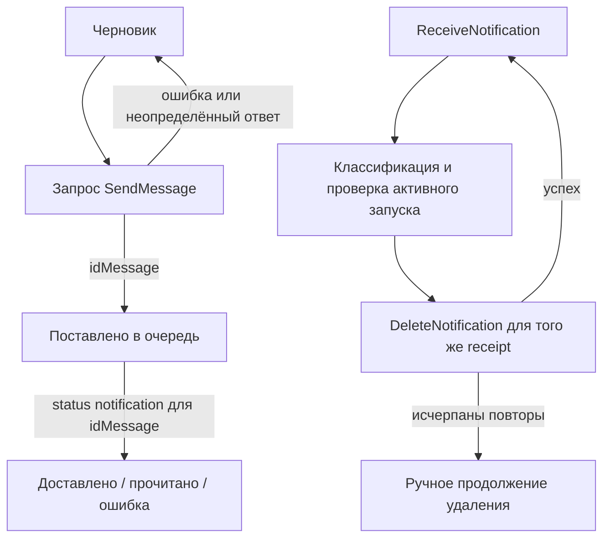

# Telegram Text Chat Refactor - Plan

## Goal Capsule

Привести существующий React-чат к проверяемому сценарию из `task.md`: открыть личный чат по номеру, отправить текст и увидеть ответ из Telegram. Исправить обнаруженные расхождения с контрактом GREEN-API и исходным планом `docs/plans/2026-09-25-0243-feat-telegram-text-chat-plan.md`, затем подтвердить работу опубликованного сайта. U6 исходного плана, скриншоты и видео, намеренно отложен и в этот рефакторинг не входит.

## Product Contract

### Problem Frame

В `main` уже есть работающий локальный каркас, но прохождение тестов не доказывает полный пользовательский сценарий. Часть тестовых ответов не соответствует Telegram API, отправка не показывает состояние «в очереди», а ссылка на опубликованный сервис отсутствует в README.

### Requirements

**Основной сценарий**

- R1. Сохранить ввод `idInstance` и `apiTokenInstance` только в памяти вкладки и один личный текстовый чат по международному номеру.
- R2. После успешного `SendMessage` ясно показать, что сообщение поставлено в очередь; при неопределённом результате сохранить черновик и предоставить только ручной повтор.
- R3. Показывать текстовые ответы только активного собеседника, подтверждать каждое корректное уведомление и не запускать параллельные запросы чтения очереди.

**Качество и выдача**

- R4. Контракт дополнительных вызовов и уведомлений проверять по документации именно Telegram API; отсутствие имени или аватара не должно блокировать чат.
- R5. Чат остаётся пригодным на ширине 320px и 1440px, с доступной с клавиатуры формой, видимым фокусом, читаемой лентой и без горизонтальной прокрутки страницы.
- R6. README содержит фактическую публичную ссылку лишь после подтверждения Pages deployment, загрузки ресурсов и браузерной проверки CORS с origin Pages.
- R7. Не включать U6 исходного плана: скриншоты, видео и ссылки на них будут отдельной задачей.

### Scope Boundaries

В работе сохраняются запрошенные позднее имя контакта, аватар и индикаторы доставки, если они не мешают основному сценарию. История, группы, медиа, хранение токена, серверный proxy и автоматические повторы неопределённой отправки не добавляются. Если практика покажет, что учётная запись со скрытым номером не позволяет надёжно сопоставить ответ без нового API вызова, сначала зафиксировать этот сценарий как ограничение, а не показывать сообщение из чужого чата.

## Planning Contract

### Verified Baseline and Findings

На `main` (`90031ed`) проходят `npm run lint`, 44 теста и `npm run build` на 2026-09-27. Проверки выполнены локально; работа реального инстанса и Pages из них не следует.

| Приоритет | Наблюдение | Основание |
| --- | --- | --- |
| P1 | Успешный `idMessage` оставляет пузырь со статусом `sending` до отдельного status notification. При отключённых статусах спиннер может остаться навсегда. Исходный U3 требует `queued`. | `src/features/chat/ChatWorkspace.tsx`, `src/App.test.tsx` |
| P1 | После cleanup polling асинхронный ответ всё ещё может вызвать `onIncoming`/`onOutgoingStatus` и изменить общий `pendingReceiptRef`: проверка `active` есть лишь до `await`. Это опасно при Strict Mode replay, выходе из чата и позднем ответе. | `src/features/chat/useNotificationPolling.ts` |
| P1 | Telegram `GetAvatar` документирует `urlAvatar`, но не `available`. Проверка `avatar.available` не даёт показать аватар на документированном ответе; мок закрепляет ошибочный формат. | `src/api/greenApi.ts`, `src/features/chat/useChatContact.ts`, `src/api/greenApi.test.ts`; [Telegram GetAvatar](https://green-api.com/telegram/docs/api/service/GetAvatar/) |
| P2 | После неудачного или неопределённого `SendMessage` текст остаётся одновременно в composer и в failed bubble. Повтор может произойти из любого места, а успешная отправка рисуется до подтверждения API. Это отличается от исходного U3. | `src/features/chat/ChatWorkspace.tsx`, `src/App.test.tsx` |
| P2 | Сообщения сопоставляются только по `senderPhoneNumber`. Telegram возвращает `0`, когда номер скрыт, поэтому ответ такого собеседника не попадёт в ленту, хотя `senderData.chatId` существует. | `src/features/chat/useNotificationPolling.ts`; [Telegram incoming notification](https://green-api.com/telegram/docs/api/receiving/notifications-format/incoming-message/Webhook-IncomingMessageReceived/), [GetContactInfo](https://green-api.com/telegram/docs/api/service/GetContactInfo/) |
| P2 | `.message-list` не является отдельной областью прокрутки; при длинной переписке растёт весь экран. Ручная проверка 320px/1440px и клавиатурного сценария не зафиксирована. | `src/styles.css` |
| P2 | Workflow Pages и base path есть, но README не содержит фактической ссылки. Текущий deployment и Pages-origin CORS не удалось подтвердить из этого окружения. | `.github/workflows/deploy-pages.yml`, `README.md` |

### Key Technical Decisions

- KTD1. Использовать [документацию Telegram SendMessage](https://green-api.com/telegram/docs/api/sending/SendMessage/) и Telegram receiving как источник формы сообщений. Ссылки `/v3/docs/` из `task.md` сейчас ведут к MAX; совпадение части маршрутов не заменяет проверку Telegram payload.
- KTD2. Разделить состояние исходящего сообщения на `sending` и `queued`; обновлять его по статусам доставки только для известного `idMessage`. При ошибке запроса оставить текст только в composer для ручного повтора; ошибка доставки после подтверждённого `idMessage` остаётся на bubble.
- KTD3. Каждому запуску polling дать отдельную область действия. После любого `await` проверить, что запуск ещё активен, прежде чем отдавать уведомление UI, менять receipt или планировать следующую операцию. При ошибке удаления сохранить текущий receipt для ручного продолжения.
- KTD4. Получать стабильный Telegram `chatId` из документированного ответа `GetContactInfo`, если он доступен, и использовать его для сопоставления ответа со скрытым номером. При отсутствии проверенной связи между телефоном и `chatId` не присваивать входящее сообщение активному чату.
- KTD5. Сначала подтвердить deployment и CORS с конечного origin, затем добавить публичный URL в README. Для проверки использовать отдельный тестовый инстанс без сохранения токена и полных URL в репозитории.

### High-Level Technical Design

Направление для состояния отправки и очереди:

## Implementation Units

Нумерация продолжает исходные U1–U6, чтобы U6 оставался явно отложенным. Рекомендуемый порядок: U7 → U8 → U9 → U10 → U11.

### U7. Align the Telegram API contract and contact identity

- **Goal:** Исправить контракт имени и аватара и получить пригодную для сопоставления идентичность собеседника без обязательной зависимости чата от contact lookup. Covers R3, R4.
- **Files:** `src/api/greenApi.ts`, `src/domain/chat.ts`, `src/features/chat/useChatContact.ts`, `src/api/greenApi.test.ts`, `src/App.test.tsx`.
- **Approach:** Зафиксировать реальные поля `GetContactInfo` и входящего уведомления по Telegram документации. Использовать `avatar` и `chatId` из одного ответа `GetContactInfo`; удалить отдельный `GetAvatar` вызов, который сейчас ждёт недокументированное поле `available`. Проверять URL перед передачей в `img`, сохранив fallback на номер и работу send/polling при ошибке lookup. Не вводить `CheckAccount` в основной путь без доказанной необходимости.
- **Test scenarios:** `GetContactInfo` с `chatId`, именем и `avatar` сохраняет все нужные поля; пустой avatar оставляет fallback. Ошибка lookup не блокирует отправку или получение. Telegram event с `senderPhoneNumber: 0` отображается только при совпадении проверенного `chatId`; другой `chatId` игнорируется.
- **Verification:** Контрактные тесты с Telegram fixtures и интеграционный тест фильтрации уведомлений проходят без реальных credentials.

### U8. Make outgoing message state truthful

- **Goal:** Убрать бесконечное «Отправляется» и неоднозначный двойной повтор после ошибки. Covers R2.
- **Files:** `src/features/chat/ChatWorkspace.tsx`, `src/App.test.tsx`, `src/styles.css`.
- **Approach:** При ошибке запроса оставить текст в composer без failed bubble; повтор возможен только через кнопку отправки. При пришедшем позже статусе `failed` для уже подтверждённого `idMessage` оставить failed bubble с отдельной кнопкой ручного повтора. После `idMessage` показать `queued` независимо от включения `outgoingWebhook`; последующие `delivered`/`read` обновления привязывать по ID. Не сопоставлять status без ID с «последним отправляемым» сообщением, если нельзя доказать эту связь.
- **Test scenarios:** Успешный send без status notification показывает «В очереди» и очищает composer. Ошибка сохраняет текст и не создаёт автоматически вторую отправку. Повтор требует отдельного действия. Статус неизвестного `idMessage` не меняет текущий bubble. Поздний статус от предыдущей попытки не меняет новую.
- **Verification:** UI tests покрывают отправку, ошибку, ручной повтор и независимость queued от status notifications.

### U9. Isolate polling runs and preserve receipt ordering

- **Goal:** Исключить обновления от завершённого запуска и сохранить последовательную обработку очереди. Covers R3.
- **Files:** `src/features/chat/useNotificationPolling.ts`, `src/features/chat/useNotificationPolling.test.tsx`, `src/App.test.tsx`.
- **Approach:** Проверить состояние запуска после receive/delete, включая ответ от мока или транспорта, который проигнорировал abort. Не делить незащищённый receipt между старым и новым запуском. Сохранить существующие задержки 1/2/4 секунды и ручное возобновление с тем же receipt после неудачного delete.
- **Test scenarios:** Поздний receive после unmount или Strict Mode cleanup не добавляет сообщение и не удаляет receipt. Повторный запуск создаёт один consumer. Неудачный delete не разрешает новый receive; ручной retry удаляет прежний receipt. Чужие и non-text события подтверждаются, но не рисуются.
- **Verification:** Hook tests доказывают порядок receive → classify → delete → receive и отсутствие эффектов старого запуска.

### U10. Make the chat viewport usable

- **Goal:** Сохранить заголовок и composer доступными при длинной ленте и проверить мобильный/десктопный путь. Covers R5.
- **Files:** `src/styles.css`, `src/features/chat/ChatWorkspace.tsx`, при необходимости `src/App.test.tsx`.
- **Approach:** Ограничить высоту chat viewport и сделать `.message-list` собственной областью прокрутки. При первом открытии расположить ленту внизу; при новом сообщении прокручивать вниз только если пользователь уже рядом с низом. Сохранять видимый focus и связь сообщений об ошибках с полями.
- **Test scenarios:** Много сообщений не уводят composer за пределы chat viewport. Новое сообщение не сбрасывает чтение более ранних. На 320px и 1440px нет горизонтальной прокрутки страницы, меню стран, поля и действия доступны с клавиатуры; ошибка телефона связана с input.
- **Verification:** Ручной browser check на обоих viewport и keyboard flow; автоматизировать только устойчивые поведенческие проверки прокрутки.

### U11. Verify and finish publication evidence

- **Goal:** Закрыть невыполненную часть U5 без выдачи неподтверждённого URL. Covers R6.
- **Files:** `README.md`, `.github/workflows/deploy-pages.yml`, `vite.config.ts` только при выявленной ошибке.
- **Approach:** Проверить production build с `/green-api-test/`, GitHub Pages deployment output, загрузку JS/CSS и browser CORS для GET, JSON POST и DELETE с фактического Pages origin. После успешной проверки вписать публичную ссылку и кратко описать условия запуска. Если доступа к deployment или тестовому инстансу нет, сохранить этот пункт открытым без утверждения, что сервис работает.
- **Test scenarios:** Build использует repository base path. Публичная страница открывается без 404 ресурсов и configuration error. Отдельный тестовый инстанс подтверждает читаемые ответы трёх методов и цикл отправки/ответа. README содержит URL только после этих проверок.
- **Verification:** `npm run lint`, `npm run test`, `VITE_BASE_PATH=/green-api-test/ npm run build`, затем ручной Pages-origin smoke check без записи credentials в артефакты.

## Verification Contract

| Проверка | Критерий |
| --- | --- |
| `npm run lint` и `npm run test` | Все проверки проходят; новые тесты используют документированные Telegram payloads, а не только формат старых моков. |
| `VITE_BASE_PATH=/green-api-test/ npm run build` | Production assets имеют правильный base path. |
| Browser check 320px и 1440px | Нет горизонтальной прокрутки, доступны форма, чат, composer, ошибки и focus. |
| Реальный чат и CORS | Отправленный текст помечается как queued, ответ появляется один раз; GET/POST/DELETE читаются из origin Pages. |
| Безопасность материалов | Токен, ID инстанса, полный URL запроса и сырой ответ отсутствуют в коммитах, README и проверочных артефактах. |

## Definition of Done

U7–U10 завершены, когда тесты и browser check подтверждают основной сценарий, включая поздние polling responses и отправку без уведомления о доставке. U11 завершён только после проверки опубликованной страницы и добавления фактической ссылки в README. U6 остаётся отдельной намеренно отложенной задачей.
