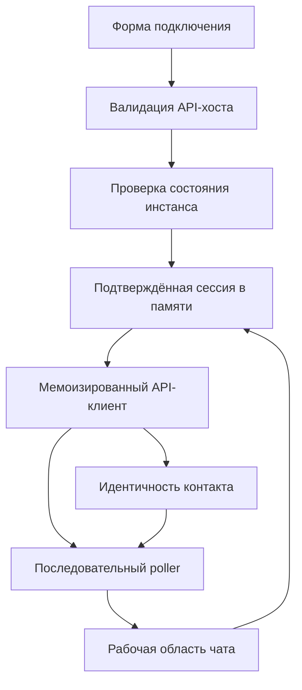
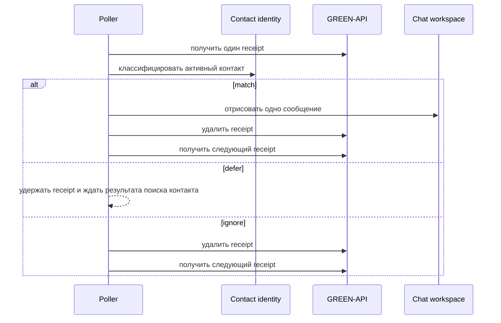
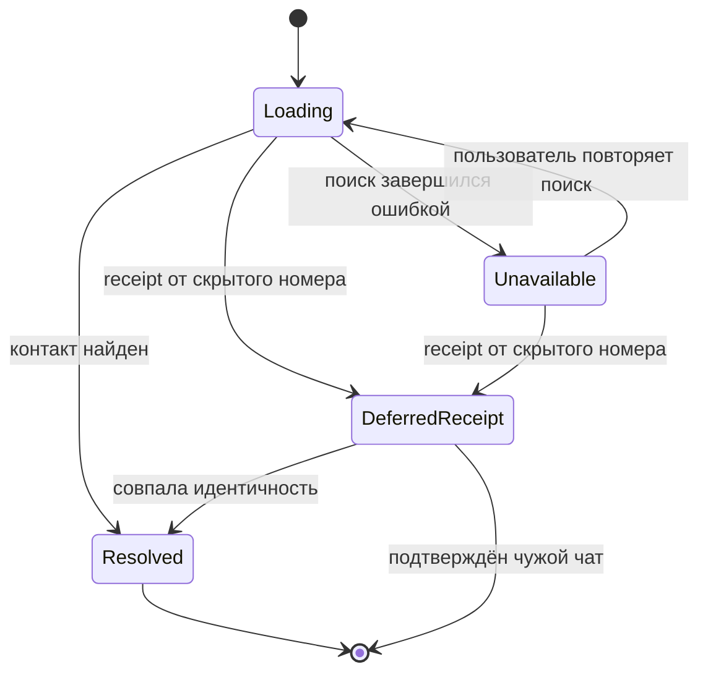

# План исправления замечаний GREEN-API

## Goal Capsule

- **Цель:** Проверяющий может подключить собственный инстанс GREEN-API, обменяться поддерживаемыми текстовыми сообщениями без потери записей очереди и предсказуемо использовать демо одного чата.
- **Подход:** Хранить параметры подключения в памяти вкладки, нормализовать поддерживаемые уведомления на границе API и сохранить последовательное владение receipt. (KTD1, KTD2, KTD3, KTD4)
- **Источник полномочий:** `docs/review/green-api-test-review.md` определяет замечания 1–16. Замечания 17–18 пользователь отложил.
- **Стоп-условия:** Не сохранять credentials и историю чата вне памяти вкладки. Не добавлять список чатов, медиа или backend-proxy.

---

## Product Contract

### Кратко

План исправляет замечания 1–16 к клиенту одного личного чата GREEN-API. Приложение остаётся browser-only и хранит временные данные только в памяти, но его подключение, уведомления, composer и документация приводятся к ожидаемому сценарию.

### Проблема

Pages-сборка может обращаться к неверному API-шарду, а очередь способна подтвердить потенциально нужное входящее сообщение до того, как приложение установило его контакт. Несколько менее критичных расхождений мешают демо вести себя как заявленный Telegram-подобный чат и дают новому contributor устаревшие инструкции.

### Requirements

**Подключение и сессия**

- R1. Форма принимает и валидирует публичный HTTPS `apiUrl` из консоли инстанса, хранит его в подключении из памяти вкладки и не сохраняет его с credentials вне React state.
- R2. До монтирования чата приложение проверяет credentials через `getStateInstance`; при неверном, неавторизованном или неуспешном preflight пользователь остаётся на форме с безопасной ошибкой и может повторить попытку.
- R3. Возврат из чата сохраняет текущие данные подключения, историю и снимок имени/аватара каждого чата в памяти вкладки; повторное открытие сразу восстанавливает историю и контактное оформление, а reload очищает их.
- R4. Экземпляр API-клиента стабилен для подтверждённого подключения, поэтому обычный rerender `App` не перезапускает поиск контакта или polling.
- R5. Международный номер только из цифр нормализуется как международный ввод, не ослабляя существующую защиту префикса выбранной страны.

**Входящая очередь и отображение**

- R6. Поддерживаемый текст из личного чата отображается один раз со временем из provider notification: обычный текст, расширенный текст/ссылка и текстовый ответ с цитатой.
- R7. Входящая запись со скрытым номером подтверждается только после классификации как активный контакт или как заведомо чужая; пока контакт не определён, receipt удерживается, а пользователь получает путь восстановления вместо безвозвратного удаления сообщения.
- R8. Приложение сохраняет единственного последовательного consumer очереди: сначала классифицирует receipt, затем подтверждает его, не допускает пересечения старого и нового polling-run и сохраняет ownership при cleanup.
- R9. Успешный ответ `deleteNotification` с `result: false` означает уже обработанный receipt и не останавливает polling; отклонённый delete по-прежнему следует текущей стратегии retry и ручного восстановления.

**Исходящие сообщения**

- R10. Клиент отправляет trimmed-значение draft, принимает не более 4 096 символов и не делает запрос для пустого или слишком длинного текста. Лимит соответствует Telegram `sendMessage`: 1–4 096 символов текста.
- R11. Enter отправляет валидный draft, Shift+Enter добавляет перенос строки, а следующие drafts могут попасть в очередь, пока прежний запрос ещё не завершился.

**Документация и границы**

- R12. README объясняет намеренное ограничение одним активным личным чатом, настройку API-хоста для инстанса и совместимую с Vite версию Node.js.
- R13. Pages deployment и архитектурная документация больше не зависят от API-хоста, заданного при сборке, если его владельцем становится форма подключения.

### Критерии успеха

- Новый проверяющий вводит API-хост из консоли, credentials и получателя, а чат открывается только после успешного preflight.
- Обычный ответ, ответ со ссылкой/расширенным текстом и текстовый ответ с цитатой от активного контакта отображаются один раз и безопасно продвигают очередь.
- Сообщение со скрытым номером, пришедшее до завершения поиска контакта, остаётся восстанавливаемым и не исчезает из очереди.
- Back сохраняет сессию, историю и снимок имени/аватара контакта в памяти; refresh очищает их.
- Инструкции для contributor соответствуют опубликованному приложению и требованию Vite 7 к Node.js.

### Участники

- A1. Пользователь демо вводит данные инстанса GREEN-API, читает и отправляет сообщения.
- A2. Удалённый контакт отвечает через messaging provider.
- A3. GREEN-API возвращает состояние инстанса и FIFO-уведомления.
- A4. Contributor репозитория настраивает и публикует статическое приложение на Pages.

### Ключевые сценарии

- F1. **Подключение и проверка**
  - **Триггер:** A1 отправляет форму подключения.
  - **Результат:** Чат запускается только после валидного API-origin и разрешённого состояния инстанса. Covers R1, R2, R4, R5.
- F2. **Получение и подтверждение текста**
  - **Триггер:** A3 возвращает receipt.
  - **Результат:** Приложение отображает подтверждённый текст нужного контакта, подтверждает его receipt и только потом читает следующую запись. Covers R6, R7, R8, R9.
- F3. **Отправка текста с сохранением контекста**
  - **Триггер:** A1 отправляет сообщение из composer или возвращается редактировать подключение.
  - **Результат:** Нормализованный draft и статусы исходящих сообщений остаются связаны с нужной сессией чата. Covers R3, R10, R11.

### Примеры приёмки

- AE1. Covers R1, R2. Не-HTTPS хост или неуспешная проверка состояния показывают ошибку формы и не запускают поиск контакта или polling.
- AE2. Covers R6, R8. `textMessage`, `extendedTextMessage` и текстовый `quotedMessage` из активного личного чата создают по одному bubble со временем уведомления до чтения следующего receipt.
- AE3. Covers R7, R8. Ответ со скрытым номером во время загрузки контакта удерживает receipt; при совпадающем `chatId` он отображается и подтверждается, а заведомо чужой чат только подтверждается.
- AE4. Covers R9. `deleteNotification` с `result: false` не создаёт terminal polling state; следующий receive начинается без повторного delete того же receipt.
- AE5. Covers R3, R10, R11. Back заполняет форму данными из памяти, повторное открытие того же контакта сразу показывает историю, имя и аватар до фонового обновления контакта; Enter и Shift+Enter следуют правилам composer, а два исходящих сообщения сохраняют независимые состояния.

### Границы scope

#### Отложено на отдельную работу

- Замечание 17: уменьшить или убрать текущую сложность avatar, country-combobox, статусов, retry и state machine только после стабилизации исправленного поведения.
- Замечание 18: отдельно решить, нужно ли убирать из публичной версии AI-похожие планы и solution-артефакты. В этой работе не удалять `docs/plans/**`, `docs/solutions/**`, диаграммы и коммиты, не переписывать Git history.

#### Вне идентичности продукта

- Список чатов, история нескольких чатов, медиа, группы, backend-proxy, постоянное хранение credentials и межвкладочная координация.

---

## Planning Contract

### Key Technical Decisions

- KTD1. **Владельцем API-хоста является форма.** Поле получает документированный публичный origin по умолчанию, но пользователь заменяет его хостом из своей консоли при необходимости; значение нормализуется в HTTPS origin и существует только в подтверждённом подключении из памяти. Pages variable перестаёт быть вторым источником истины. GREEN-API строит запрос из `apiUrl`, instance ID и token, полученных в консоли. (R1, R13)
- KTD2. **Вход в чат проходит через безопасный state preflight.** В API-клиент добавляется `getStateInstance`; сессию подтверждает только `stateInstance: 'authorized'`. Отсутствующее, malformed, `notAuthorized`, `blocked`, `starting`, `yellowCard` или неуспешное состояние остаётся безопасным неуспешным результатом формы без URL, token и raw body. (R2)
- KTD3. **Идентичность контакта и классификация входящего сообщения моделируются явно.** Поиск контакта имеет состояния `loading`, resolved identity и recoverable unavailable. Polling различает `match`, `ignore` и `defer`; только `defer` удерживает текущий receipt и приостанавливает чтение очереди. (R6, R7, R8)
- KTD4. **Поддерживаемый текст и время provider нормализуются один раз на границе API.** Из документированных форм сообщений извлекается одно literal text-значение, а provider timestamp переводится в domain-значение для UI; malformed non-text остаётся игнорируемым. (R6)
- KTD5. **Владение receipt и отправка сообщений остаются разными процессами.** Сохраняется инвариант receive/classify/delete, а исходящие запросы идут через локальную FIFO с per-message state. `result: false` после delete — это результат, позволяющий двигаться дальше, а не transport failure. (R8, R9, R10, R11)
- KTD6. **Снимки сессий хранятся на уровне `App`, а клиент мемоизируется по подтверждённому подключению.** История индексируется API-origin, instance ID и нормализованным получателем; `ConnectionForm` получает значения из памяти для повторного использования. (R3, R4)
- KTD7. **Основной план ограничен замечаниями 1–16.** (session-settled: user-directed — chosen over включение замечаний 17–18 в основной план: пользователь оставил оба пункта опциональными.)

### High-Level Technical Design

### Влияние на систему

- `App` становится владельцем подтверждённого подключения и снимков чат-сессий, поэтому форма, клиент, polling и workspace получают стабильные входные данные.
- `greenApi.ts` и `domain/chat.ts` становятся единственной границей преобразования новых API-полей и форм уведомлений; UI-компоненты не знают о raw payload.
- Poller остаётся единственным владельцем receipt. Поиск контакта может задержать очередь, но не должен разрешить второго consumer или позволить позднему cleanup-результату изменить active run.
- Документация, workflow deployment и диаграммы описывают один runtime-источник API-хоста.

### Риски и зависимости

- **Контракт внешнего API:** перед реализацией подтвердить по актуальным официальным fixtures значение успешного `getStateInstance` и единицу provider timestamp; при отличии корректировать только normalizer. Митигировать контрактными API-тестами.
- **Целостность очереди:** широкая переработка poller может вернуть double delete или late-run behavior. Митигировать сохранением `inFlightRef`, active-check после await, ownership pending receipt и текущих cleanup-тестов из `docs/solutions/logic-errors/polling-run-receipt-ordering.md`.
- **Раскрытие credentials:** новый хост и preflight добавляют форму и сетевые пути. Митигировать безопасными `GreenApiError` и запретом на показ или persistence raw URL, token и body.
- **Параллельные исходящие:** статусы нескольких drafts могут прийти в другом порядке. Митигировать привязкой UI только к local ID и возвращённому `idMessage`, но не к тексту.

### Источники

- `docs/review/green-api-test-review.md`
- `docs/solutions/logic-errors/polling-run-receipt-ordering.md`
- [Формат запроса GREEN-API](https://green-api.com/en/docs/request-format/)
- [GREEN-API GetStateInstance](https://green-api.com/en/docs/api/account/GetStateInstance/)
- [GREEN-API SendMessage](https://green-api.com/en/telegram/docs/api/sending/SendMessage/)
- [Расширенный входящий текст GREEN-API](https://green-api.com/en/docs/api/receiving/notifications-format/incoming-message/ExtendedTextMessage/)

---

## Implementation Units

### U1. Preflight подключения и стабильная сессия в памяти

- **Цель:** Пользователь подключается к собственному API-хосту только после проверки состояния, а затем возвращается к сохранённому в памяти подключению без создания нового клиента при несвязанном rerender.
- **Requirements:** R1, R2, R3, R4, R5. Covers F1 / AE1.
- **Dependencies:** Нет.
- **Files:** `src/App.tsx`, `src/App.test.tsx`, `src/config/runtime.ts`, `src/config/runtime.test.ts`, `src/api/greenApi.ts`, `src/api/greenApi.test.ts`, `src/domain/chat.ts`, `src/features/connection/ConnectionForm.tsx`, `src/features/connection/ConnectionForm.test.tsx`.
- **Подход:**
  1. Заменить блокирующую форму deployment-конфигурацию controlled input для API-origin и моделью подтверждённого подключения согласно KTD1 и KTD6.
  2. Добавить безопасную нормализацию state на API-границе и удерживать форму в pending, пока preflight не вернёт разрешённое состояние согласно KTD2.
  3. По Back сохранять значения и снимки каждого чата, изолировать их по подключению и получателю, мемоизировать клиента по полному подтверждённому подключению.
  4. Нормализовать plausible digits-only international input до текущего пути country detection, не меняя защиту префикса выбранной страны.
- **Patterns to follow:** Controlled validation в `ConnectionForm.tsx`; безопасные API-errors и URL encoding в `src/api/greenApi.ts`; integration setup в `src/App.test.tsx`.
- **Test scenarios:**
  - Covers AE1. Валидный HTTPS origin и `authorized` открывают чат ровно один раз.
  - Пустой, HTTP, содержащий credentials, path, query или malformed origin оставляет форму видимой и не запускает chat effects.
  - Terminal или retryable request, а также `notAuthorized`, `blocked`, `starting`, `yellowCard`, malformed и отсутствующее state остаются безопасной ошибкой формы без token и raw API body в DOM.
  - Для того же `App` connection клиент не пересоздаётся и polling не перезапускается после parent rerender.
  - Back предзаполняет API origin, credentials и получателя; повторное открытие того же получателя восстанавливает сообщения, имя и аватар, а другой получатель не наследует эти данные.
  - `79001234567` проходит валидный международный путь, а country formatting и prefix protection продолжают работать.
- **Проверка:** Мок успешного preflight создаёт одну стабильную чат-сессию; невалидные input и state response не могут смонтировать polling или раскрыть credentials.

### U2. Нормализация состояния и уведомлений API

- **Цель:** Все consumers получают единое typed representation состояния инстанса, поддерживаемого текста и provider timestamp.
- **Requirements:** R2, R6. Covers AE2.
- **Dependencies:** U1.
- **Files:** `src/api/greenApi.ts`, `src/api/greenApi.test.ts`, `src/domain/chat.ts`.
- **Подход:**
  1. Расширить нормализованный контракт клиента состоянием инстанса, не меняя safe-error taxonomy.
  2. Извлекать literal text из plain, extended и textual quoted payload согласно KTD4.
  3. Нормализовать provider timestamp в одном месте с явным deterministic fallback для отсутствующего или malformed значения.
- **Patterns to follow:** `normalizeNotification`, `stringField` и record guards в `src/api/greenApi.ts`; проверки redaction credentials в `src/api/greenApi.test.ts`.
- **Test scenarios:**
  - Документированный state response создаёт accepted или rejected connection result без раскрытия credentials.
  - Plain text, extended/link text и textual quoted reply нормализуются в reply text с chat identity и timestamp.
  - Медиа, malformed body и неизвестная форма уведомления не создают отображаемый текст.
  - Historical timestamp переводится в domain time unit, а absent или invalid timestamp использует объявленный fallback.
- **Проверка:** Интерпретация новых remote payload покрыта на API-границе до того, как их используют hooks или компоненты.

### U3. Polling без потери сообщений с учётом контакта

- **Цель:** Отображать и подтверждать только безопасно классифицированные сообщения, сохраняя lifecycle единственного consumer receipt.
- **Requirements:** R6, R7, R8, R9. Covers F2 / AE2 / AE3 / AE4.
- **Dependencies:** U1, U2.
- **Files:** `src/features/chat/useChatContact.ts`, `src/features/chat/useNotificationPolling.ts`, `src/features/chat/useNotificationPolling.test.tsx`, `src/App.test.tsx`.
- **Подход:**
  1. Открыть lifecycle identity и возможность retry в `useChatContact` для KTD3.
  2. Ввести classification `match`, `ignore` и `defer`, не меняя ownership `pendingReceiptRef` и `inFlightRef`.
  3. Удерживать deferred receipt от скрытого номера до безопасного результата identity и дать пользователю recovery action после ошибки поиска.
  4. Считать false-результат delete обработанным и продолжать очередь, а transport failure вести через retry/manual recovery из KTD5.
- **Execution note:** До изменения classification добавить characterization coverage для текущего late settlement и old-delete handoff.
- **Patterns to follow:** `docs/solutions/logic-errors/polling-run-receipt-ordering.md`; cleanup и retry tests в `src/features/chat/useNotificationPolling.test.tsx`.
- **Test scenarios:**
  - Covers AE3. Hidden-number receipt до завершения delayed lookup не вызывает delete и второй receive; после matching identity он один раз отображается, удаляется и очередь продолжается.
  - Ошибка lookup сохраняет ambiguous hidden receipt восстанавливаемым; повтор поиска может обработать его без дубликата.
  - Подтверждённый foreign hidden chat, unrelated и malformed record подтверждаются, но не отображаются.
  - Covers AE2. Каждое поддерживаемое текстовое уведомление отображается один раз с provider time; duplicate `idMessage` по-прежнему подавляется.
  - Covers AE4. False delete result ведёт к следующему receive без terminal state и повторного delete.
  - Late receive или delete очищенного run не могут отрисовать, удалить дважды или пересечь replacement run; rejected delete повторяет исходный receipt до следующего receive.
- **Проверка:** Порядок receipt соблюдается в normal, deferred, false-delete, retry, cleanup и contact-retry путях.

### U4. Корректный composer и независимая очередь исходящих

- **Цель:** Исходящий текст соблюдает лимит provider и keyboard behavior Telegram, не блокируя следующие drafts.
- **Requirements:** R3, R10, R11. Covers F3 / AE5.
- **Dependencies:** U1, U2.
- **Files:** `src/features/chat/ChatWorkspace.tsx`, `src/App.test.tsx`, `src/domain/chat.ts`.
- **Подход:**
  1. Использовать одно ограничение 4 096 для hint, поля, validation и network payload, отправляя только trimmed draft.
  2. Пропустить Enter и Shift+Enter через один validation path, сохранив IME composition и native multiline input.
  3. Заменить form-global send lock локальной FIFO и per-message transitions, сохранить обработку ранних delivery status по `idMessage`.
  4. Использовать нормализованный inbound timestamp для incoming bubble и сохранить read-aware scrolling.
- **Patterns to follow:** Текущие message state transitions и pending-status cache в `ChatWorkspace.tsx`; scoped assertions message list в `src/App.test.tsx`.
- **Test scenarios:**
  - Draft из 4 096 trimmed characters отправляется один раз, а 4 097 символов и whitespace-only input не делают запрос.
  - API получает текст без пробелов по краям, а текст, введённый во время предыдущего request, не очищается случайно.
  - Enter отправляет валидный textarea draft, Shift+Enter добавляет newline, а IME composition не вызывает случайную отправку.
  - Два быстрых drafts запускают network requests в local FIFO; remote statuses после собственных `idMessage` обновляют только соответствующий bubble.
  - Ошибка одного send не отключает и не портит другой queued send, retry относится только к failed message.
  - Backlog incoming record показывает provider time, а не текущее время теста.
- **Проверка:** Composer остаётся доступным, отключаются только invalid drafts, а каждый outgoing status привязан к собственному message ID.

### U5. Согласование документации и Pages configuration

- **Цель:** Инструкции по clone, deploy и границам продукта соответствуют runtime-форме подключения.
- **Requirements:** R12, R13.
- **Dependencies:** U1.
- **Files:** `README.md`, `.github/workflows/deploy-pages.yml`, `.env.example`, `docs/diagrams/README.md`.
- **Подход:**
  1. Удалить устаревшую build-time передачу API-host и примеры environment variables, если U1 делает форму единственным владельцем.
  2. Описать получение точного API-host из консоли инстанса, безопасность browser-only credentials и ограничение одним активным чатом.
  3. Обновить prerequisite Node.js до совместимого с Vite 7 диапазона и привести к нему Pages workflow.
  4. Обновить диаграммы, чтобы deployment больше не подразумевал выбор API-шарда через environment value.
- **Patterns to follow:** Текущий Pages base-path setup в `.github/workflows/deploy-pages.yml`; guidance по public demo и redaction credentials в `README.md`.
- **Test scenarios:**
  - Reader чистого clone следует инструкции подключения и Pages без недокументированной environment variable.
  - Документация не выдаёт загрузку страницы за доказательство API CORS и сохраняет три необходимых browser checks.
  - Workflow продолжает передавать repository base path без runtime API-host dependency.
- **Проверка:** README, workflow, environment example и диаграммы согласованно описывают configuration и supported scope.

---

## Verification Contract

| Проверка | Применяется к | Признак готовности |
| --- | --- | --- |
| `npm run lint` | U1–U5 | Lint проходит без проигнорированных новых diagnostics. |
| `npm run test` | U1–U5 | API, hook, form и integration scenarios покрывают заявленные регрессии. |
| `npm run build` | U1–U5 | Статическая production-сборка проходит без API-хоста проверяющего. |
| Browser smoke check с Pages origin | U1–U5 | Выделенный инстанс подтверждает CORS для GET receive, POST send и DELETE notification с final Pages origin. |
| Ручная responsive-проверка | U1, U4, U5 | Форма и чат используются без horizontal page scroll на 320 px и 1440 px. |

---

## Definition of Done

- Для замечаний 1–16 есть тесты либо документированный путь ручной проверки, подтверждающий исправленное поведение.
- API host, instance ID, token, raw URLs и raw responses не сохраняются и не показываются в errors, logs, presentation material или tracked configuration.
- Polling сохраняет receipt serialization и late-run protection из `docs/solutions/logic-errors/polling-run-receipt-ordering.md`.
- Документация репозитория описывает один активный личный чат и API host, заданный в форме.
- Все verification gates проходят, включая CORS smoke check с deployed origin, если Pages опубликован.
- Опциональные замечания 17–18 не затронуты без отдельного разрешения.
- Перед завершением удалён abandoned experimental code и устаревшая configuration, появившиеся во время реализации.
